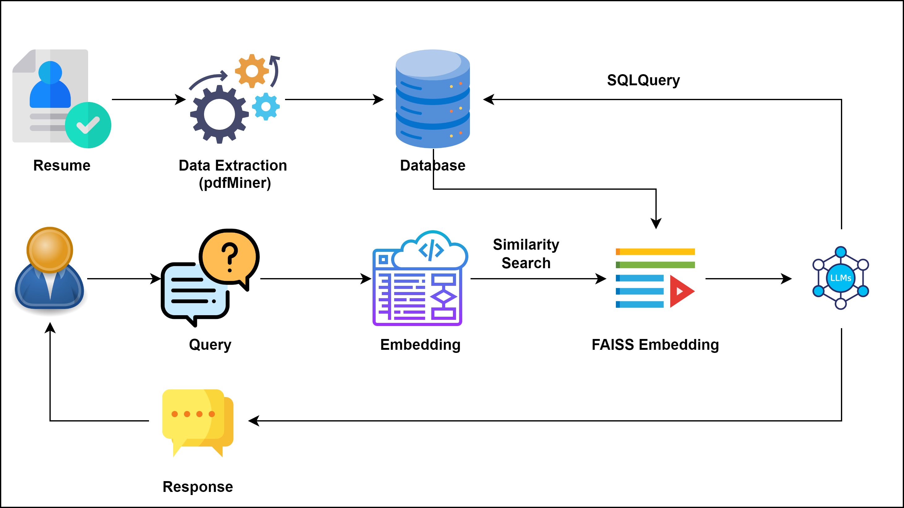

# **TalentGPT**

### **Business Problem**:
Hiring processes involve sorting through numerous resumes to identify the most suitable candidates, a time-consuming and error-prone task. Manually analyzing resumes can result in overlooking important qualifications and skills. Organizations require an efficient solution to automate and enhance the resume analysis process while extracting valuable insights from the data.

### **Solution**:
The use of a resume parser, employing technologies like tesseract-ocr, offers a transformative solution to this challenge. OpenAI is utilized to extract user information from resumes, while tesseract-ocr aids in converting resume PDFs into text format, facilitating further analysis.

### **Potential Users:**
**Human Resources Teams**: HR departments of companies can use the resume parser to streamline and expedite the resume screening process, ensuring the identification of the most qualified candidates.
**Recruitment Agencies**: Recruitment agencies can use the technology to efficiently match candidates with job opportunities, enhancing their service quality.
**Job Boards and Career Websites**: Platforms hosting job listings can incorporate resume parsing to help candidates submit their information more conveniently and accurately.

### **Potential Impact:**
**Time and Resource Saving**s: Resume parsing reduces the time and resources required for manual screening, allowing recruiters to focus on higher-value tasks.
**Enhanced Efficiency**: Automation ensures thorough analysis of numerous resumes simultaneously, reducing the chances of overlooking crucial qualifications.
**Improved Candidate Matching**: Accurate extraction of skills and qualifications enhances the matching process, leading to the identification of better-fit candidates.
**Reduced Bias**: The use of technology minimizes human bias in screening, leading to a fair assessment of candidates based on their qualifications.
**Strategic Insights**: Analyzing trends in skills and experiences provides insights into the job market, helping organizations refine their hiring strategies.

### **Data:**
The data primarily consists of resume documents in PDF format. The extracted text serves as the input for analysis. The data may include personal information, contact details, work experience, education history, skills, and more.

### **Approach:**
**PDF to Text Conversion**: tesseract-ocr is employed to convert resume PDFs into text format, making the data accessible for further analysis.
**Information Extraction**: OpenAI is used to extract user information, such as name, contact details, work experience, education, and skills, from the parsed text.
**Data Storage and Analysis**: The extracted information is stored in a structured format, allowing for easy querying and analysis.

### **High-Level Diagram:**

- Resumes are uploaded to the application.
- Using **pdfMiner** to convert the PDF to text. Then with the help of the **OpenAI**, we are extracting the information. Such as Name, Email_id, Contact No., and Skill Set.
- Then we store the data in the **SQL** database. 
- We user passes a query to the application it gets embedded and then passed to the LLM to generate a SQL query.
- Generated SQL query then is used to fetch the data from the SQL and with the query it is passed on to the LLM to generate a response to the user query. 

### **Demo**
In the application, we have three user modes: Candidate, Internal User, and Recruiter/Admin Section. 
Below is the Demo of the **Candidate** Section. 
- In the Normal user section user will upload the Resume from the local drive using the choose your resume option. By dragging or using the browse file option. 
- Once the user has uploaded the resume the application will use NLP techniques to extract the basic personal information and the skill set of the user.
- User can view the uploaded resume and the extracted information such as Name, Contact No., Email id, No. of Resume Page, and Skills.
- All the relevant information is then stored in the SQL Database.

Below is the Demo of the **Internal User** Section
- In this section, members of an organization's internal team will be able to utilize a chat feature. 
- This enables them to ask questions pertaining to the resumes that have been uploaded, such as inquiring about the names and email addresses of individuals possessing Java skills.
- In addition to the chat feature, users will also have access to an interactive table that allows them to apply filters for table sorting.

Below is the Demo of the **Recruiter/Admin** Section.
- Users will receive a prompt to input the admin username and password.
- After successful validation, users can access a comprehensive list of all resumes uploaded to the application.
- Additionally, the system will display the extracted information from each resume in a tabular format.
- Users will gain access to a chat feature, allowing them to pose queries related to the uploaded resumes, such as requesting the names and email addresses of individuals with Java skills.
- Our approach involves harnessing OpenAI's capabilities to translate user queries into SQL queries, which are subsequently sent to the database for data retrieval.
- The retrieved data is then presented in a conversational way.

### **Conclusion**:
The use of resume parsing technology powered by tesseract-ocr and OpenAI presents a transformative solution to the time-consuming and error-prone process of manual resume screening. By automating the extraction of user information and converting PDFs into text format, organizations can significantly enhance their hiring processes, leading to better candidate matching, reduced bias, and strategic insights into the job market. This technology empowers HR teams, recruitment agencies, and job platforms to streamline their operations and make more informed decisions.

